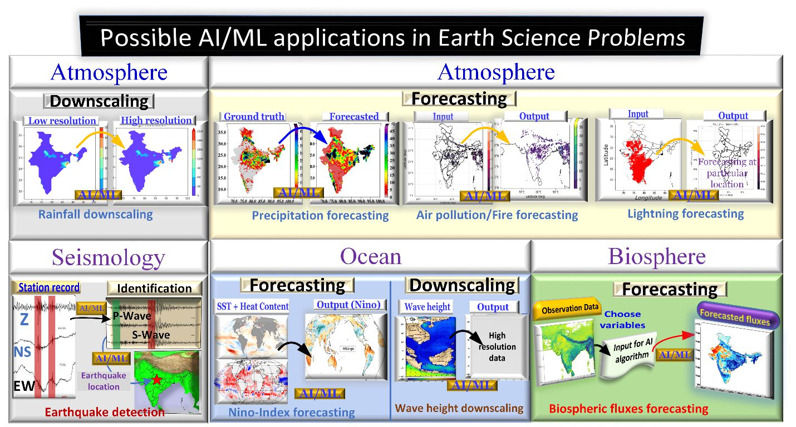

Applications of artificial intelligence and machine learning in Earth sciences 
=====================================================================================
The AI/ML algorithms have vast applications in the Earth Science problems. Figure 2 depicts few 
applications in the areas, including atmosphere/biosphere, seismology, and ocean. 
Figure 2: An overview of the application of AI/ML algorithms in few areas from Earth Science problems.
The precipitation forecasting can include data from short-range, medium-range and extended-range 
forecasting.

   *Figure 2: An overview of the application of AI/ML algorithms in few areas from Earth Science problems. The precipitation forecasting can include data from short-range, medium-range and extended-range forecasting.*

Statistical downscaling
______________________________
Downscaling of data is necessary to get a local projection of the information. The present-day 
models and observations generated from weather stations (or other instruments) are available at 
coarser resolution and are irregularly spaced, which may often provide misrepresentation (or 
absence) of precipitation, temperature, or other variables at local levels. Downscaling of Indian 
Summer Monsoon (ISM) rainfall is a difficult task as it involves a multi-scale spatiotemporal 
dynamical process with significant variance18
. Further, regional variations of ISM rainfall are 
often quite large varying from a few millimeters to thousands of millimeters within a few hundred 
kilometers. The ISM rainfall can be classified into different coherently fluctuating zones, which 
may be linked to complex multi-scale processes19–21
.
The statistical downscaling is a low-cost method to obtain information at the local scale and 
provide it to stockholders. Artificial Intelligence (AI) and Machine Learning (ML) techniques are 
being used for statistical downscaling8,22
. Recently, development in the Single Image SuperResolution (SR) using Deep Learning proved to be one of the best methods used for this purpose8–
10 . Another method that showed promising results in the statistical downscaling is the ConvLSTM 
method documented by Harilal and coauthors23
.

Seismological events
__________________________
The growing volume of seismological and other geoscience-related datasets acquired from surface 
and borehole studies, require efficient techniques for analysis and trend recognition to extract 
valuable signals. AI/ML tools have been applied in different fields in seismology, from event 
identification to earthquake prediction, with varying degrees of success24–29 The case studies also 
bring out the need for further research and development to refine the existing techniques and 
develop new tools that could be utilised in the processing and analyses of large datasets and 
identification of different geophysical signals. The use of AI/ML techniques in geoscience / 
seismological could be employed gainfully to analyse other seismological datasets that are 
routinely acquired by MoES and its affiliated institutions. Identifying seismic phases, accurately,
is one of the primary requirements for seismological data analysis towards the determination of 
earthquake source parameters. ML is planned to be used in identifying different seismic phases in 
the data. 
In many earthquake detection algorithms, STA/LTA criteria are being used to detect possible 
arrival times of P and S waves30 . Later, matched filtering or template matching technique was 
used for event detection. In this method, waveforms of known events are used as templates to scan 
through continuous waveforms to detect new events
31
. Recently, ML is utilized to improve 
earthquake detection and phase picking capabilities25,32
. Fingerprinting and Similarity 
Thresholding (FAST) is the latest algorithm using ML techniques to identify earthquakes without 
prior knowledge of seismicity. Being computationally more efficient than template matching 
FAST would facilitate automated processing of large voluminous datasets. Similarly, the 
generalized phase detection (GPD) algorithm searches for near identical waveforms from millions 
10
of seismograms, which is used to classify windowed data as P, S or noise. GPD can be applied to 
datasets that were not just encompassed by training sets but can also be applied to difficult cases 
such as clipped seismograms. Kong et al., (2018)
33
used Neural Networks (NN) for training to pick 
P-wave onset and to detect P-wave polarity. ML techniques have important applications in the 
detection of small magnitude local earthquakes in areas which are characterized by sparsity of 
receivers. ML/AI algorithms may play an important role in the identification of events and in 
locating earthquakes with recordings of the events at fewer stations33
. Other applications in earth 
sciences such as hydrology, AI/ML can be used for estimating and predicting stream flow in 
ungauged basins35–37
.

Short and medium range forecasting using machine learning 
_________________________________________________________________
Currently, the global highest resolution ensemble predication system at ~12.5 km horizontal 
resolution (with 21 members) is being used for providing 10 days probabilistic forecast based on 
the Global Ensemble Forecast System (GEFS@T1534) India Meteorological Department. The 
high resolution GEFS has been implemented by IITM for operational application since June 2018. 
While the deterministic GFS model38
at 12.5 km provides a better skill up to ~5 days compared 
to the earlier coarser resolution (~25 km resolution GFST574)39
, the ensemble prediction system 
has shown much better skill than the control member (the deterministic GFS model) particularly 
for predicting extreme rainfall events40-41 . The model forecast inaccuracies mainly arise from 
initial conditions and improper physical parameterizations. The uncertainties of initial conditions 
are largely resolved by the perturbed initial conditions in the ensemble prediction system, however,
the uncertainty arising from deterministic closures of the physical parameterization still adds much 
errors due to unrealistic constraints, namely the quasi-equilibrium42
. Under the AI/ML/Dl 
paradigm, the use of sub-grid scale tendencies generated by the cloud resolving models within 
each climate model grid as the input of a deep learning model for training to target the heat and 
moisture trained tendencies hold promise in improving the model fidelity43–45
.

Machine learning for extended range forecasts
____________________________________________________
AI/ML methods recently find applications in the climate forecast models. Two basic applications 
show promise for near future applications. The first one is the bias correction and improvement of 
numerical model forecast. The other one is the methods attempting the sub seasonal low frequency 
forecast. The bias correction and model post processing applications are of much use to the 
stakeholders using climate forecast. The climate forecasts from the dynamical models show a lot 
of bias when forecast is considered over scales lower than the balanced flow, mainly arising due 
to unknown physics or unresolved dynamics. In situations where enough observation are available 
over a location, some of the systematic errors arising due to unresolved scale dynamics or physics 
can be corrected46
. Subseasonal forecasting using machine learning methods are recently under 
active research12,47–49

Machine learning for seasonal and climate scale forecasting 
________________________________________________________________
11
Seasonal forecasting is one of the tough problems in forecasting. As pointed out by Lorenz (1963)50
the weather forecasts are strongly dependent on initial conditions (today’s weather determines 
tomorrow’s weather) and in contrast climate projections/decadal predictions (an average of 
weather for a few decades) do not suffer from the initial conditions, however, depends on boundary 
conditions. When we try to make seasonal forecasts, the distinction is rather blurred and the 
seasonal forecasts still depend on intial conditions51
. Chattopadhyay et al (2016)51
have shown that 
models hindcasts initialized with February initial conditions exhibit better prediction skill for 
Indian Summer Monsoon rainfall (ISMR). Further complexities such as resolving ocean processes 
also become important at seasonal scale. Hence, extracting predictive information (which changes 
from event to event) across both space and time scales is very important to make significant 
progress in seasonal forecasts52
. Therefore, use of AI/ML methods for making improved seasonal 
forecasts is imperative and research community started using these methods widely in seasonal 
forecasts53–55
and some researchers even believe that AI/ML methods can outperform
conventional prediction systems54-55
.
One of the long-standing seasonal prediction problems is prediction of Indian summer monsoon 
rainfall. H.F. Blandford started seasonal forecasting of Indian summer monsoon using empirical 
methods in 1886. Since then, numerous attempts were made to predict seasonal mean monsoon 
over India using both empirical models and dynamical models (Atmosphere and coupled oceanatmosphere models, see review article of Rao et al., (2019)
39
for more details). Empirical models 
showed very high skills (>0.9) during development stages and during actual operational phase they 
showed weak skills (<0.5). On the other hand, dynamical models showed moderate skill during 
hindcast period as well as during operational forecast39
. The major reason for empirical models’
failure to provide high skills during operational phase is that the relationship between predictor 
and predictands undergo secular changes from the time the model was developed to the phase 
when it is made operational. To avoid such a situation AI/ML models can be used efficiently to 
identify new predictors53
. Using autoencoders Saha et al (2021)53
have developed an AI/ML model 
to predict IMSR with two months lead time and absolute mean error less than 3%. On the other 
hand, the dynamical models exhibit systematic biases in precipitation (See Rao et al., 201939
) and 
basically arise due to parametrization schemes used in these models and therefore underestimate 
extremes. To avoid such systematic problems AI/ML models will become handy.

Machine learning for improving the physical processes in dynamical models
___________________________________________________________________________________
Dynamical models work on the principle of solving partial differential equations over the area of 
interest with the necessary initial and boundary conditions. They consist of various components 
such as atmosphere, ocean, land surface and others. The correct representation of physical 
processes in the numerical models is highly essential for accurate simulations of the coupled 
climate system. For example, various researchers have tried to understand the relationship of 
global and regional teleconnections such as ENSO56-57
, IOD58
, North Atlantic Oscillation59
, 
Pacific Decadal Oscillation60 , volcanic eruptions61 , aerosols62-63 to Indian monsoon. Recent 
studies have attempted the use of deep learning to develop models which better represent the 
physical processes. For example, Witt et al (2019)
64
used deep reinforcement learning based 
approach to test the stratospheric aerosol injection on climate. Volcanic eruptions have been used 
12
as an analog for the stratospheric aerosol injection and deep learning can assist in addressing the 
non-linear nature of the problem. Recently Lamb et al (2021)
43
used graph neural networks to learn 
the aerosol optical properties. Similarly, Seifert et al (2020)
65
discuss the role of machine learning 
in estimating the cloud microphysics. The uncertainties in the simulation of Indian monsoon arise 
from the missing or erroneous physics in the dynamical systems. Machine learning to improve the 
physical processes can lead to cascading returns by improving the hydrological outputs from the 
numerical weather prediction models66–70
. 

Machine learning for Nowcasting and tracking the storms cells
___________________________________________________________________
The need for a high-resolution early warning system with reliable nowcasts in the regions of steep 
topography and urban areas during severe weather is highly essential. Traditionally, Nowcasting 
is served by carrying out extrapolation, probabilistic Nowcasting71 , semi-Lagrangian advection 
scheme72
, and using algorithms like optical flow etc. The latest data-driven approach is playing a 
key role in the area of Nowcasting too. Doppler Weather Radar provides extremely high 
geographical and temporal resolution weather information. Agarwal et al. (2019)
73
utilised radar 
pictures to forecast the weather using the U-Net algorithm, demonstrating that it outperformed the 
optical flow technique. Su et al., (2020)
74
have shown that machine learning approaches have a 
high learning capacity and enhance echo position and intensity forecast accuracy in convective 
cells. The temporal precision of such convective cells varies from 30 to 60 minutes during a 
relatively short period of time. The underestimating of precipitation in complicated orography 
regions is a well-known problem in precipitation estimation. Arulraj and Ana, (2021)
75
used 
detection and classification machine learning algorithms to improve orographic precipitation 
across the Southern Appalachian Mountains. Machine Learning for NWP.
Satellite remote sensing and NWP groups are ripe for rapid advancement in their application of 
machine learning. The NWP relies heavily on the integration of fields generated by satellites and 
other remote sensing devices. Gaps, both spatially and temporally, are a common occurrence in 
such data. The existence of gaps, both spatially and temporally, is a typical issue in such 
observations. The time series of satellite ocean fields are constructed using an ensemble of NNs 
with varying weights76
, and a deep learning method to reconstruct the optical images77
. When 
modeling, deploying systems, and even issuing warnings, the ML method can give a post-forecast 
correction to account for uncertainties after learning from all previous failures78
.