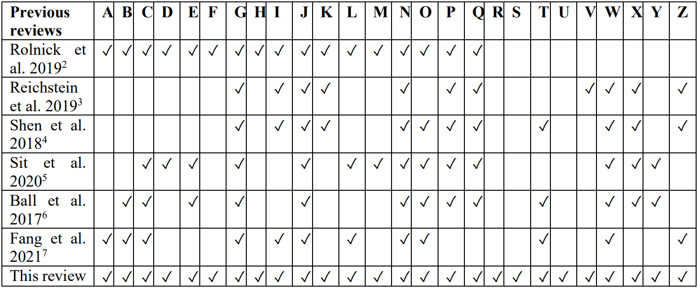
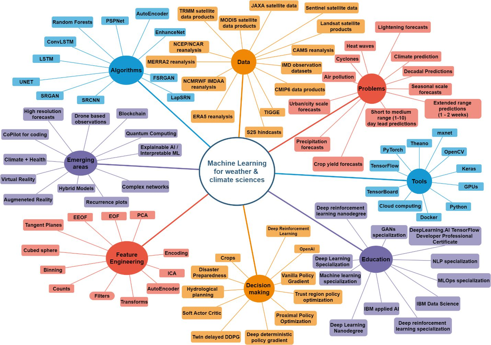

Introduction
============
The recent increase in computational power has given rise to application to novel techniques. In 
the last few decades in conjunction with increasing computational power we notice significant 
improvement in forecasts at various scales using numerical techniques. The advent of satellites, 
modern instruments and advanced global/regional modelling capabilities has helped in amassing 
large amounts of data surpassing petabytes per day. Hence the need of the hour is to exploit this 
data innovatively. These datasets have been collected using sensors that monitor magnitudes of 
states, fluxes, and more intensive or time/space-integrated variables. The Earth system data 
exemplify all four of the “Four V’s of Big Data” concerning volume, velocity, variety, and 
veracity. Looking at the big picture shows that our capacity to gather and store data vastly outpaces 
our ability to access it, much alone comprehend it meaningfully. The power to make accurate 
predictions has not risen in parallel with data abundance. We will need to undertake two significant 
endeavors to maximize the wealth of Earth system data growth and diversity, which are 
(1) identifying and utilizing data insights, and 
(2) developing predictive models that can discover previously unknown laws of nature while still 
honoring our evolving understanding of the laws of nature. 
Advances in computing capacity and enhanced data availability provide exceptional new 
prospects. For example, machine learning and artificial intelligence technologies are now 
accessible, but they require additional development and adaptation to geoscientific study. In both 
spatial and temporal domains, new methods present new opportunities, new problems, and ethical 
demands for contemporary study fields in ESS1.
Machine learning algorithms have grown with data availability, successfully applying to many 
geoscientific processing schemes, including the atmosphere, the land surface, and the ocean. Land 
cover and cloud classifications have been precursors to the GIS field since the resurgence of neural 
networks, thanks to the availability of very high-resolution satellite data. The majority of machine 
learning research in methodology (for example, kernel techniques or random forests) has since 
been applied to geoscience and remote sensing issues. That is frequently the case with new data 
appropriate for the specific approaches. In other words, machine learning has emerged as a 
versatile method for geoscientific data categorization. For example, change and anomaly detection 
issues may now be tackled using these techniques. In addition, deep learning has been employed 
in geoscience in the past several years to exploit better spatial and temporal patterns in the data, 
aspects that standard machine learning often struggles. Machine learning finds applications
throughout all of ESS, and more algorithms are being incorporated into operational systems. New 
patterns are being discovered, in addition to the knowledge used to assess the many Earth system 
models. 

Need for machine learning in ESS
____________________________________
Machine learning aims to uncover the transformation functions which map to the fields of high 
interest such as precipitation, temperature, and others. The developments in the physical sciences 
associated with simple statistical methodologies have left a large gray area in uncovering the 
relationships leading to complex, non-linear variables. There is a need to dedicate resources to
using advanced machine learning based tools to decipher the links to physical fields which are still 
out of our reach and improve their predictability. Developments in deep learning, deep 
reinforcement learning, transformers, non-linear science and recent advances in interpretable 
machine learning are the areas that can help to solve crucial research problems in ESS.
Recognizing this need to effectively utilize this large data effectively, the Ministry of Earth 
Sciences recently setup a virtual centre for Artificial Intelligence and Machine Learning devoted 
to Earth Sciences and anchored at the Indian Institute of Meteorology, Pune. 

Related surveys
___________________
Previous surveys on the use of machine learning in ESS are summarized in Table 1. These reviews 
have mostly focused on the broad applications of machine learning in Earth science problems. 
Rolnick et al. 20192
focus is the most elaborated review yet on the topic, but they focused in 
general on the solutions to tackle the problems associated with climate change using machine 
learning. Others focused more on hydrology or remote sensing problems, with Reichstein et al.
20193
being the nearest survey to the one we have worked upon in this paper.

   *Abbreviations: A-Electricity Systems, B- Transportation systems, C- Buildings & Cities/Urban climate, D- Industrial systems, E- Farms & Forests, F- Climate change mitigation, G- Weather & Climate prediction, H- Climate finance, ICausality, J- Computer vision, K-Interpretable machine learning, L-Natural language processing, M-Reinforcement learning, N-Time series, O-Transfer learning, P-Uncertainty estimation, Q-Unsupervised learning, R- Seismology, SSouth Asian Monsoon, T- Short-range weather prediction, U-Extended range weather forecasting, V- Seasonal weather prediction, W- Hydrology, X-Oceanography, Y- Transformers or Generative adversarial networks, Z- weather and climate extremes*

Motivation for this study
______________________________
* The previous surveys have only addressed the problems within ESS in general. There is a need for a review paper focusing on the studies and issues addressing the South Asian region. For example, the Indian monsoon is one of the most complex climate phenomena whose mystery is yet not fully solved. It requires special focus and attention to address the challenges in accurately predicting the various spatiotemporal scales of the monsoon. 
* The studies summarized in Table 1 have not considered the latest state-of-the-art algorithms such as the attention-based Transformers and the Generative Adversarial Networks. The advancements brought by these models in the computer vision and natural language processing community make them excellent candidates to be explored in the domain of ESS. 
* This review outlines all the previous review papers on the subject, delineates the tools required, the material required by anyone to gain hands-on experience in machine learning and can be used to further the applications of machine learning in ESS. 

   *Figure 1: Mind map of multidimensional areas related to machine learning in weather and climate sciences*