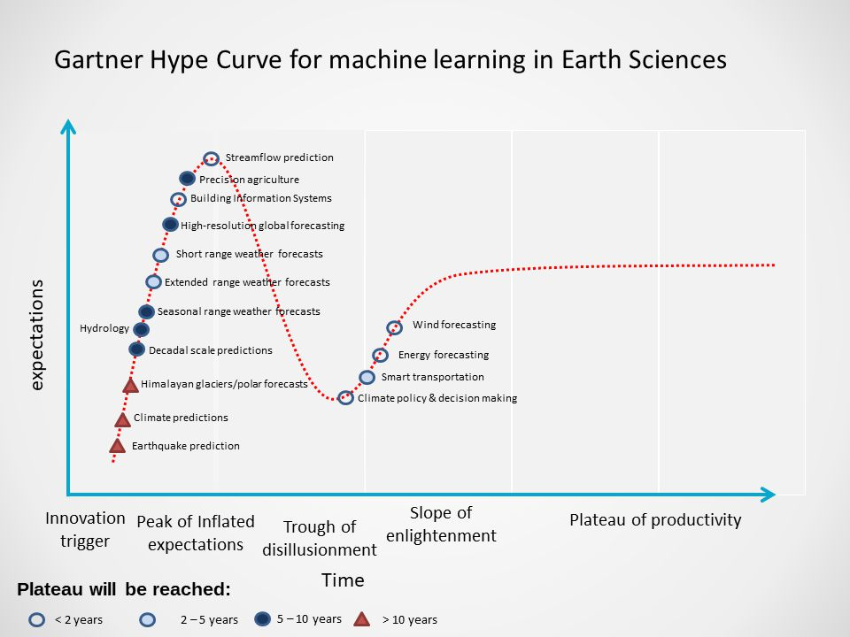

Summary 
=================================

   *Figure 3: Gartner’s hype cycle for machine learning in ESS with a focus on research problems associated with South Asia*

In this study, a review of the applications of machine learning in ESS has been made. The future 
directions focused on solutions for the South Asian region have been summarized as a Gartner’s 
curve in Figure 3. Hard AI problems such as that of earthquake prediction and climate scale 
predictions. These problems require long lead times of several years to centuries and will take 
more than a decade of development to be fully solved by machine learning and allied techniques. 
Such a long development time is expected because of the sparsity of data, for example, over the 
Himalayan region, under the solid Earth for earthquake prediction. The large uncertainties in 
dynamical models to project end of century estimates of the climate are also expected to be 
resolved after extensive research and development. Recent developments in machine learning, 
particularly in deep learning are expected to lead to transformative improvements in the short to 
extended range forecast, smart transportation, precision agriculture, policymaking, wind and 
energy forecasts during this decade. These advancements would be driven by the critical nature of 
these problems and the availability of high spatiotemporal drones, ground-based observations and 
satellite datasets. 
We have discussed various AI/ML techniques used and the ones that have high potential for 
improving the state-of-the-art in the ESS. An exhaustive literature survey on the applications over 

South Asian domain, a mind map incorporating all the essential components of data science 
applications in ESS, and a Gartner’s curve for future directions are the main contributions of this 
study. It can be used as a starting point to understand the existing research problems, applicable 
algorithms, educational resources required, hardware/software needs and other important aspects 
essential to work on the applications. As an end goal, this work aims to further the ESS over South 
Asia using machine learning applications.
